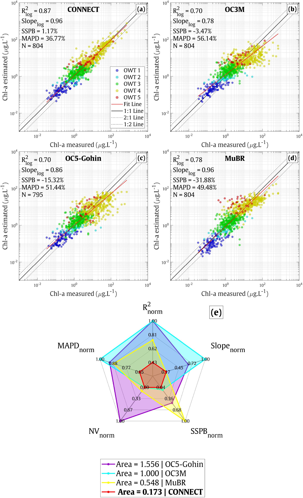
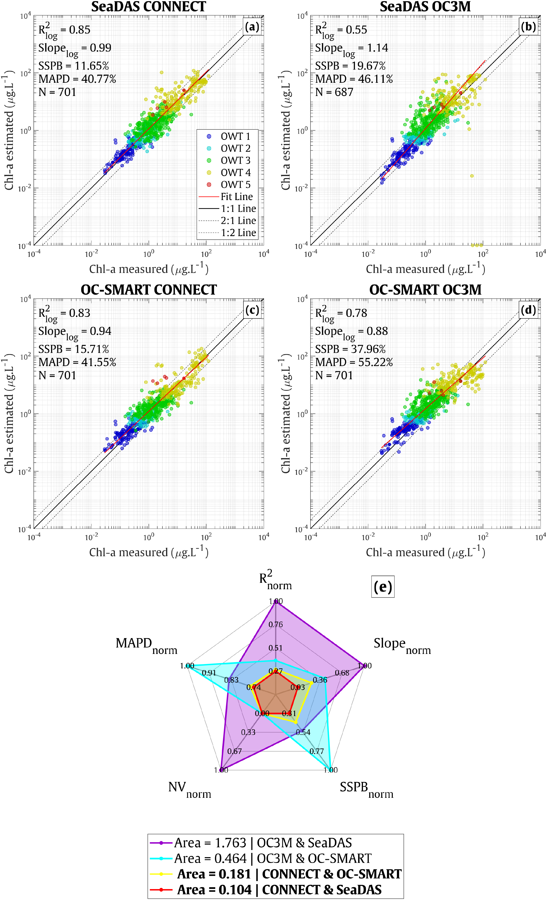

**Combination Of Neural Network models for Estimating Chlorophyll-a over Turbid and Clear Waters**

## Overview
Chl-CONNECT is a Python/MATLAB library designed for estimating Chlorophyll-a concentrations (Chl-a) for multiple satellite sensors including MODIS, MERIS, OLCI, and MSI. 
The library applies machine learning and statistical methods to predict chlorophyll concentrations and classify water body into different Optical Water Types.

### Key Features
- Multi-sensor support: MODIS, MERIS, Sentinel-3/OLCI, Sentinel-2/MSI
- Chlorophyll-a estimation for clear and turbid waters
- Optical Water Type (OWT) classification


## About
This repository contains source code for the following papers:
* Tran, M.D.; Vantrepotte, V.; Loisel, H.; Oliveira, E.N.; Tran, K.T.; Jorge, D.; Mériaux, X.; Paranhos, R. Band Ratios Combination for Estimating Chlorophyll-a from Sentinel-2 and Sentinel-3 in Coastal Waters. Remote Sens. 2023, 15, 1653. https://doi.org/10.3390/rs15061653

## Installation

### Prerequisites
Before installing and using Chl-CONNECT, please ensure your system meets the following requirements:
- Python 3.7 or later
- NumPy
- SciPy
- h5py
- Matplotlib
- Pandas
- scikit-learn
- joblib
- MATLAB (optional) R2019b or later.

Install these Python packages using pip:
```bash
pip install numpy scipy h5py tensorflow keras matplotlib pandas scikit-learn joblib
```

### Setup
Clone this repository to your local machine:
```bash
git clone https://github.com/manhtranduy/Chl-CONNECT.git
cd Chl-CONNECT
```

## Usage

### Quick Start Example
#### Python Execution
To use Chl-CONNECT in Python:
```python
from common.Chl_CONNECT import Chl_CONNECT

# Initialize the Chl_CONNECT class with specified sensor data
chl_conn = Chl_CONNECT(Rrs_input=[Rrs412, Rrs443, Rrs488, Rrs531, Rrs551, Rrs667, Rrs748], sensor='MODIS')

# Retrieve chlorophyll concentrations and Optical Water Types
Chl_modis = chl_conn.Chl_comb
Class_modis = chl_conn.Class

from common.Chl_MuBR_NDCIbased import Chl_MuBR_NDCIbased

# Initialize the Chl_MuBR_NDCIbased class with specified sensor data
chl_mubr = Chl_MuBR_NDCIbased(Rrs_input=[Rrs412, Rrs443, Rrs490, Rrs510, Rrs560, Rrs665, Rrs709], sensor='OLCI')

# Retrieve chlorophyll concentrations and Optical Water Types
Chl_olci = chl_mubr.Chl_comb
Class_olci = chl_mubr.Class

```

#### MATLAB Execution
To use compute Chl-a in MATLAB:
```matlab
addpath('./common')

[Chl_modis,Class_modis]=Chl_CONNECT({Rrs412, Rrs443, Rrs490, Rrs531, Rrs551, Rrs665, Rrs748},'sensor','modis');

[Chl_olci,Class_olci]=Chl_MuBR_NDCIbased({Rrs412, Rrs443, Rrs490, Rrs510, Rrs560, Rrs665, Rrs709},'sensor','olci');
```

### Performance Metrics
Our model has been validated against an extensive in-situ/matchup dataset gathered over various environments associated with different trophic levels.

#### In-situ Validation Results

<div align="center" style="display: flex; align-items: flex-start; justify-content: center; gap: 40px;">
  <!-- Image -->
  <p style="margin:0;">
    
  </p>

  <!-- Table -->
  <table>
    <thead>
      <tr>
        <th>Class</th>
        <th>R<sup>2</sup><sub>log</sub></th>
        <th>Slope<sub>log</sub></th>
        <th>MAPD (%)</th>
        <th>SSPB (%)</th>
        <th>N</th>
        <th>Not Valid</th>
        <th>area<sub>norm</sub></th>
        <th>Model</th>
      </tr>
    </thead>
    <tbody>
      <tr><td rowspan="4"><strong>OWT 1</strong></td><td><strong>0.526</strong></td><td>0.700</td><td>41.183</td><td><strong>4.050</strong></td><td>95</td><td>0</td><td><strong>0.640</strong></td><td><strong>CONNECT</strong></td></tr>
      <tr><td>0.457</td><td><strong>0.769</strong></td><td>49.301</td><td>-72.214</td><td>95</td><td>0</td><td>1.248</td><td>MuBR</td></tr>
      <tr><td>0.466</td><td>0.653</td><td><strong>33.139</strong></td><td>12.504</td><td>95</td><td>0</td><td>0.767</td><td>OC3M</td></tr>
      <tr><td>0.380</td><td>0.697</td><td>36.376</td><td>-8.952</td><td>91</td><td>4</td><td>1.228</td><td>OC5‑Gohin</td></tr>
      <tr><td rowspan="4"><strong>OWT 2</strong></td><td>0.573</td><td><strong>0.753</strong></td><td>43.434</td><td><strong>3.344</strong></td><td>50</td><td>0</td><td><strong>0.386</strong></td><td><strong>CONNECT</strong></td></tr>
      <tr><td><strong>0.660</strong></td><td>0.564</td><td>37.341</td><td>-50.905</td><td>50</td><td>0</td><td>0.601</td><td>MuBR</td></tr>
      <tr><td>0.538</td><td>0.249</td><td><strong>36.973</strong></td><td>-3.842</td><td>50</td><td>0</td><td>0.603</td><td>OC3M</td></tr>
      <tr><td>0.282</td><td>0.291</td><td>38.501</td><td>-21.872</td><td>50</td><td>0</td><td>1.064</td><td>OC5‑Gohin</td></tr>
      <tr><td rowspan="4"><strong>OWT 3</strong></td><td><strong>0.351</strong></td><td>0.669</td><td><strong>37.569</strong></td><td><strong>1.487</strong></td><td>283</td><td>0</td><td><strong>0.612</strong></td><td><strong>CONNECT</strong></td></tr>
      <tr><td>0.196</td><td><strong>0.825</strong></td><td>44.990</td><td>-18.499</td><td>283</td><td>0</td><td>0.712</td><td>MuBR</td></tr>
      <tr><td>0.152</td><td>0.655</td><td>55.836</td><td>36.955</td><td>283</td><td>0</td><td>1.427</td><td>OC3M</td></tr>
      <tr><td>0.197</td><td>0.743</td><td>46.237</td><td>9.863</td><td>283</td><td>0</td><td>0.803</td><td>OC5‑Gohin</td></tr>
      <tr><td rowspan="4"><strong>OWT 4</strong></td><td><strong>0.702</strong></td><td><strong>0.870</strong></td><td><strong>33.802</strong></td><td><strong>-3.737</strong></td><td>344</td><td>0</td><td><strong>0.148</strong></td><td><strong>CONNECT</strong></td></tr>
      <tr><td>0.515</td><td>0.597</td><td>51.495</td><td>-35.330</td><td>344</td><td>0</td><td>0.745</td><td>MuBR</td></tr>
      <tr><td>0.152</td><td>0.572</td><td>63.927</td><td>-58.791</td><td>344</td><td>0</td><td>1.427</td><td>OC3M</td></tr>
      <tr><td>0.208</td><td>0.788</td><td>61.950</td><td>-49.994</td><td>340</td><td>4</td><td>1.717</td><td>OC5‑Gohin</td></tr>
      <tr><td rowspan="4"><strong>OWT 5</strong></td><td><strong>0.643</strong></td><td>0.664</td><td><strong>42.244</strong></td><td><strong>21.630</strong></td><td>32</td><td>0</td><td><strong>0.198</strong></td><td><strong>CONNECT</strong></td></tr>
      <tr><td>0.012</td><td>0.562</td><td>230.281</td><td>226.145</td><td>32</td><td>0</td><td>1.427</td><td>MuBR</td></tr>
      <tr><td>0.416</td><td>0.615</td><td>100.211</td><td>100.022</td><td>32</td><td>0</td><td>0.554</td><td>OC3M</td></tr>
      <tr><td>0.208</td><td><strong>0.987</strong></td><td>82.071</td><td>64.594</td><td>31</td><td>1</td><td>0.457</td><td>OC5‑Gohin</td></tr>
      <tr><td rowspan="4"><strong>Overall</strong></td><td><strong>0.870</strong></td><td>0.961</td><td><strong>36.769</strong></td><td><strong>1.168</strong></td><td>804</td><td>0</td><td><strong>0.173</strong></td><td><strong>CONNECT</strong></td></tr>
      <tr><td>0.777</td><td><strong>0.963</strong></td><td>49.477</td><td>-31.877</td><td>804</td><td>0</td><td>0.548</td><td>MuBR</td></tr>
      <tr><td>0.699</td><td>0.780</td><td>56.138</td><td>-3.469</td><td>804</td><td>0</td><td>1.000</td><td>OC3M</td></tr>
      <tr><td>0.698</td><td>0.857</td><td>51.441</td><td>-15.322</td><td>795</td><td>9</td><td>1.556</td><td>OC5‑Gohin</td></tr>
    </tbody>
  </table>
</div>


#### Matchup Validation Results
<p align="center">
  
</p>

#### Chl-a Map Examples
<p align="center">
  
  
</p>


  
### Advanced Use
For more advanced features and configurations, including adjusting parameters or using different sensors, please refer to the detailed documentation provided within the project.

### Block Processing Example
Large images can be processed using the new block processing option. The script
`example_block_processing.py` demonstrates how to load an HDF5 file and run the
CONNECT algorithm block by block:

```bash
python example_block_processing.py
```

## Contributing
We warmly welcome contributions to the Chl-CONNECT project. Please fork the repository, make your improvements or fixes, and submit a pull request for review.
